# 📝 Resumate

## 프로젝트 소개

### 개요

1. 자기소개서를 작성하는 것이 어렵고 시간이 오래 걸린다는 일상 속 불편함이 있었습니다.

2. 이를 해결하기 위해 "AI가 자기소개서를 써 주면 편하지 않을까?" 생각에 본 프로젝트를 시작했습니다.

### GitHub Projects

https://github.com/orgs/kosmo138/projects/1

## 참여 인원


## 프로젝트 소개

### 개요

1. 자기소개서를 작성하는 것이 어렵고 시간이 오래 걸린다는 일상 속 불편함이 있었습니다.

2. 이를 해결하기 위해 "AI가 자기소개서를 써 주면 편하지 않을까?" 생각에 본 프로젝트를 시작했습니다.

### GitHub Projects

https://github.com/orgs/kosmo138/projects/1

## 참여 인원

### 김수영 [@suyons](https://github.com/suyons)

**역할**

- 아이디어 기획
- 일정 관리
- 프론트엔드 프로토타입 작성 (Next.js)
- 백엔드 프로토타입 작성 (Spring Boot)
- 개발 환경 구축
- AWS 배포 설정

**브랜치**

- main
- dev
- feat/prototype

**역할**

- 아이디어 기획
- 일정 관리
- 프론트엔드 프로토타입 작성 (Next.js)
- 백엔드 프로토타입 작성 (Spring Boot)
- 개발 환경 구축
- AWS 배포 설정

**브랜치**

- main
- dev
- feat/prototype

### 백소나 [@baeksona](https://github.com/baeksona)

**역할**

- 웹 스크랩 및 자연어 처리
- 백엔드 서비스 및 컨트롤러 구현 (FastAPI)
- LLM을 이용한 AI 기반 텍스트 생성 서비스 구현

**브랜치**

- feat/web-scrap

**역할**

- 웹 스크랩 및 자연어 처리
- 백엔드 서비스 및 컨트롤러 구현 (FastAPI)
- LLM을 이용한 AI 기반 텍스트 생성 서비스 구현

**브랜치**

- feat/web-scrap

### 이동준 [@mogri89](https://github.com/mogri89)

**역할**

- 이력서 편집 페이지 프론트엔드 구현
- 이력서 CRUD 기능 통합

**브랜치**

- feat/resume-1

**역할**

- 이력서 편집 페이지 프론트엔드 구현
- 이력서 CRUD 기능 통합

**브랜치**

- feat/resume-1

### 이수진 [@WGCAT](https://github.com/WGCAT)

**역할**

- 자기소개서 목록 및 편집 페이지 프론트엔드 뷰 구현
- 자기소개서 CRUD 기능 통합

**브랜치**

- feat/letter

**역할**

- 자기소개서 목록 및 편집 페이지 프론트엔드 뷰 구현
- 자기소개서 CRUD 기능 통합

**브랜치**

- feat/letter

### 이수현 [@SH2G](https://github.com/SH2G)

**역할**

- 회원정보 CRUD 기능 프론트엔드 뷰 구현
- 회원정보 CRUD 기능 통합

**브랜치**

- feat/login-1

**역할**

- 회원정보 CRUD 기능 프론트엔드 뷰 구현
- 회원정보 CRUD 기능 통합

**브랜치**

- feat/login-1

### 이준아 [@gliderjun](https://github.com/gliderjun)

**역할**

- 카카오 계정 OAuth 로그인 기능 구현

**브랜치**

- feat/login-2

**역할**

- 카카오 계정 OAuth 로그인 기능 구현

**브랜치**

- feat/login-2

### 정유선 [@yousunning](https://github.com/yousunning)

**역할**

- 이력서 편집 페이지 프론트엔드 구현
- 이력서 CRUD 기능 통합

**브랜치**

- feat/resume-2

**역할**

- 이력서 편집 페이지 프론트엔드 구현
- 이력서 CRUD 기능 통합

**브랜치**

- feat/resume-2

### 황태윤 [@taeyounh](https://github.com/taeyounh)

**역할**

- Q&A 메뉴 페이지 프론트엔드 구현

**브랜치**

- feat/qna

## 공동 진행 작업


### 프론트엔드 UI 설계

**Figma Design**

https://www.figma.com/file/7wtthKnK4TMikHDuORa0Om/pages?type=design&node-id=103%3A195&mode=design&t=xVZxyMz59nZR3Iom-1

**전체 인원**

전체 회의를 통해 UI 구성을 설계했습니다.

**김수영 [@suyons](https://github.com/suyons)**

Figma를 이용하여 랜딩 페이지와 목록 페이지를 구체화했습니다.

**정유선 [@yousunning](https://github.com/yousunning)**

Figma를 이용하여 이력서/자소서 작성, 채용공고 페이지를 구체화했습니다.

### UML 다이어그램 작성


**Usecase**

**이수진 [@WGCAT](https://github.com/WGCAT)**

요구사항을 정리한 이후, 전체 회의를 통해 유스케이스를 정리하였습니다.

**정유선 [@yousunning](https://github.com/yousunning)**

다이어그램 초안을 Draw.io를 이용하여 정리했습니다.

**Package**

**김수영 [@suyons](https://github.com/suyons)**

전체 인원이 시스템에 대한 포괄적인 이해를 할 수 있도록 이 Package 다이어그램을 작성하여 전 인원에게 시스템을 설명하였습니다.

### 데이터베이스 설계

**전체 인원**
본인의 담당 기능을 구현함에 있어 필요한 테이블 및 컬럼을 정의하여 ERD 초안을 작성하였습니다.

**전체 인원**
본인의 담당 기능을 구현함에 있어 필요한 테이블 및 컬럼을 정의하여 ERD 초안을 작성하였습니다.

**이수진 [@WGCAT](https://github.com/WGCAT)**

각 인원이 작성한 다이어그램 초안을 취합하여 아래의 초안을 작성하였습니다.
각 인원이 작성한 다이어그램 초안을 취합하여 아래의 초안(Ver. 1)을 작성하였습니다.
각 인원이 작성한 다이어그램 초안을 취합하여 아래의 초안(Ver. 1)을 작성하였습니다.

**김수영 [@suyons](https://github.com/suyons)**

ERD를 검토 및 수정하여 AWS RDS에서 실행 중인 MySQL 데이터베이스에 반영할 예정입니다.

- ERD를 검토 및 수정하여 Ver.2 파일을 작성하였습니다.
- 쿼리를 작성하여 AWS RDS에서 실행 중인 MySQL 데이터베이스에 반영하였습니다.

- ERD를 검토 및 수정하여 Ver.2 파일을 작성하였습니다.
- 쿼리를 작성하여 AWS RDS에서 실행 중인 MySQL 데이터베이스에 반영하였습니다.

## Diagram


### Package Diagram


### Usecase Diagram


### Entity-Relationship Diagram

**Ver. 1**


**Ver. 2**


**Ver. 2**


## 개발 환경 준비


### Git 설정


[Git - Downloads](https://git-scm.com/downloads)에서 `Git`을 설치한 이후 다음 명령을 입력합니다.

```bash
# username 대신 본인의 GitHub ID를 적어 주세요
git config --global user.name "username"
# my_id@domain.com 대신 본인의 GitHub 가입 시 지정한 이메일 주소를 적어 주세요
git config --global user.email "my_id@domain.com"
```


Repository를 clone합니다.


```
git clone https://github.com/kosmo138/resumate
```


기본값으로 dev 브랜치가 선택되어 있으므로 본인의 브랜치로 전환합니다.
feat/database 대신 본인의 브랜치를 입력해 주세요.


```
git checkout feat/database
```

### docker-compose.yml


**실행 방법** [Docker Desktop 다운로드](https://www.docker.com/products/docker-desktop/)


```
docker compose up
```

1. 서버, 클라이언트, 데이터 영역의 앱을 분리하기 위해
   Docker 컨테이너로 필요 환경을 설치했으며
   다음과 같이 총 4개 컨테이너를 하나의 묶음으로 compose 했습니다.
1. 서버, 클라이언트, 데이터 영역의 앱을 분리하기 위해
   Docker 컨테이너로 필요 환경을 설치했으며
   다음과 같이 총 4개 컨테이너를 하나의 묶음으로 compose 했습니다.
1. 이 구성 그대로 AWS 배포까지 진행할 예정입니다.
1. 개발 시 Docker 이용은 선택사항입니다.
1. 본인의 담당 기능을 구현하는 데 있어서 Python은 필요 없고 Node.js 하나만 필요하다면 컨테이너를 사용하지 않고 로컬에 설치하여 사용해도 상관 없습니다.

**각 컨테이너의 역할**


- Docker 컨테이너를 실행한다면 로컬 설치를 진행할 필요가 없습니다.
- Nginx: 리버스 프록시 [로컬 설치 링크](https://nginx.org/en/download.html)
- Amazon Corretto (OpenJDK 21): SpringBoot 프로젝트 실행 [로컬 설치 링크](https://docs.aws.amazon.com/corretto/latest/corretto-21-ug/downloads-list.html)
- Node: Next.js 프로젝트 실행 [로컬 설치 링크](https://nodejs.org/en/download/)
- Python: FastAPI 프로젝트 실행 [로컬 설치 링크](https://www.python.org/downloads/)

## 꼭 지켜 주세요


### 민감 정보


1. 민감 정보 예시
   - 데이터베이스 주소, 사용자명, 비밀번호
   - Open API Key
   - 데이터베이스 주소, 사용자명, 비밀번호
   - Open API Key
2. 민감 정보가 담긴 파일은 `.gitignore` 파일에 정의하여 GitHub 원격 서버로 Push되지 않도록 설정했습니다.
3. **`.gitignore` 파일을 절대 삭제하지 마시기 바랍니다.**
4. `.java`, `.tsx`, `.py` 등 코드 파일에 민감 정보를 포함하지 말아 주세요.
5. `.env` 환경 변수 파일에 별도로 저장하시기 바랍니다.
6. **GitHub 서버에 민감 정보를 포함한 파일이 업로드되지 않도록 주의해 주시기 바랍니다.**
7. 제외 파일은 다음 사진과 같이 파일 이름이 회색으로 표시됩니다.

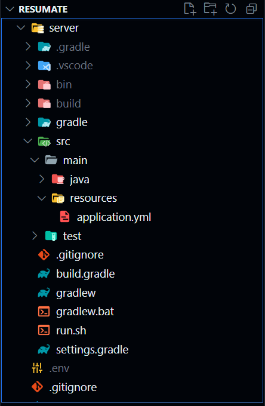

### 브랜치


```
main: 사용자에게 배포 가능한 상태
└── dev: 개별 기능 통합, 테스트 이후 main 병합
    ├── feat/prototype: 프로토타입
    ├── feat/login-1: 이메일 로그인
    ├── feat/login-2: 카카오 OAuth 로그인
    ├── feat/resume-1: 이력서 편집기
    ├── feat/resume-2: 이력서 목록
    ├── feat/letter: 자기소개서 메뉴
    ├── feat/web-scrap: 웹 스크래핑 및 FastAPI 백엔드
    └── feat/qna: Q&A 메뉴
```


1. 본인에게 배정된 브랜치만을 이용해 주시기 바랍니다. 타인의 브랜치에 commit & push 하면 충돌이 발생합니다.
2. **본인의 브랜치에서 commit & push를 1일 1회 이상 진행해 주시기 바랍니다.**
   기능 구현 여부와 관계 없이 실시간 진행도를 파악하기 위한 목적입니다.
   기능 구현 여부와 관계 없이 실시간 진행도를 파악하기 위한 목적입니다.

### 책임 범위


본인의 담당 기능에 관련된 모든 작업은 본인이 해야 합니다.

- E-R 다이어그램 작성
- 데이터베이스 구성
- 프론트엔드 뷰 구현
- 백엔드 서비스 및 REST 컨트롤러 구현
- 단위/통합 테스트
- dev 브랜치에 기능 병합
- E-R 다이어그램 작성
- 데이터베이스 구성
- 프론트엔드 뷰 구현
- 백엔드 서비스 및 REST 컨트롤러 구현
- 단위/통합 테스트
- dev 브랜치에 기능 병합

단, 다음의 작업은 통합적인 것으로 김수영이 합니다.

- 초기의 공통적인 데이터베이스 설정 (사용자, 권한 설정 등)
- UML 다이어그램 (Package) 작성

- 초기의 공통적인 데이터베이스 설정 (사용자, 권한 설정 등)
- UML 다이어그램 (Package) 작성

## Style Guide


1. **Formatter를 꼭 사용해 주시기 바랍니다.**
2. VS Code에서의 `Format Document` 단축키: `Alt + Shift + F`
3. 각 언어별로 제가 사용하고 있는 Formatter의 설치 링크를 추가했습니다.


### SQL

- [SQL 스타일 가이드 (Gitlab)](https://hing9u.tistory.com/83)
- Formatter: [SQLTools](https://marketplace.visualstudio.com/items?itemName=mtxr.sqltools)

- [SQL 스타일 가이드 (Gitlab)](https://hing9u.tistory.com/83)
- Formatter: [SQLTools](https://marketplace.visualstudio.com/items?itemName=mtxr.sqltools)

### Java

- [Java 코딩 스타일 가이드](http://developer.gaeasoft.co.kr/development-guide/java-guide/java-coding-style-guide/)
- Formatter: [Language Support for Java(TM) by Red Hat](https://marketplace.visualstudio.com/items?itemName=redhat.java)
- Eclipse 단축키: `Ctrl + Shift + F`

- [Java 코딩 스타일 가이드](http://developer.gaeasoft.co.kr/development-guide/java-guide/java-coding-style-guide/)
- Formatter: [Language Support for Java(TM) by Red Hat](https://marketplace.visualstudio.com/items?itemName=redhat.java)
- Eclipse 단축키: `Ctrl + Shift + F`

### Javascript

- [코딩 스타일](https://ko.javascript.info/coding-style)
- Formatter: [Prettier](https://marketplace.visualstudio.com/items?itemName=esbenp.prettier-vscode)

- [코딩 스타일](https://ko.javascript.info/coding-style)
- Formatter: [Prettier](https://marketplace.visualstudio.com/items?itemName=esbenp.prettier-vscode)

### Python

- [구글 Python 스타일 가이드](https://yosseulsin-job.github.io/Google-Python-Style-Guide-kor/#s1.1)
- Formatter: [Black Formatter](https://marketplace.visualstudio.com/items?itemName=ms-python.black-formatter)

- [구글 Python 스타일 가이드](https://yosseulsin-job.github.io/Google-Python-Style-Guide-kor/#s1.1)
- Formatter: [Black Formatter](https://marketplace.visualstudio.com/items?itemName=ms-python.black-formatter)

### Git Commit

- [[Git] Commit Message Convention (협업을 위한 git 커밋컨벤션)](https://velog.io/@msung99/Git-Commit-Message-Convension)

- [[Git] Commit Message Convention (협업을 위한 git 커밋컨벤션)](https://velog.io/@msung99/Git-Commit-Message-Convension)

### 파일 및 폴더 이름

- 영문 소문자와 숫자로만 구성한다.
- 가능하면 짧게 구성한다(축약어 사용).
- 특수문자와 공백sᴘᴀᴄᴇ은 사용하지 않는다.
- 단어와 단어의 구분은 `-`(ʜʏᴘʜᴇɴ)으로 구성한다.

- 영문 소문자와 숫자로만 구성한다.
- 가능하면 짧게 구성한다(축약어 사용).
- 특수문자와 공백sᴘᴀᴄᴇ은 사용하지 않는다.
- 단어와 단어의 구분은 `-`(ʜʏᴘʜᴇɴ)으로 구성한다.

```
(Bad) /분석 프로젝트/01.TEST/(1월) 결과
(Good) /analysis-project/01-test/01-result
```

## Frontend 작업 안내


### CSS


CSS 라이브러리로 Tailwind CSS를 적용하였습니다.

사용 방법은 아래 링크를 통해 Docs 참고 바랍니다.

- Docs https://tailwindcss.com/docs/installation
- Tailwind 연습 https://play.tailwindcss.com/
- Docs https://tailwindcss.com/docs/installation
- Tailwind 연습 https://play.tailwindcss.com/

### shadcn/ui


1. [Radix UI](https://www.radix-ui.com/) 기반으로 사용자가 주도권을 가지고 자유롭게 수정할 수 있도록 수정된 컴포넌트 라이브러리
2. 주요 링크

   - [Next.js 프로젝트 생성부터 버튼 추가까지](https://ui.shadcn.com/docs/installation/next)
   - [컴포넌트 목록](https://ui.shadcn.com/docs/components/accordion)
   - [적용 예시](https://ui.shadcn.com/)
   - [적용 예시 - 소스 코드](https://github.com/shadcn-ui/ui/tree/main/apps/www/app/examples)

### [Figma](https://www.figma.com/)


1. 일관성 있는 UI 구현을 위해 Figma를 이용하여 **선 디자인, 후 코딩** 방식으로 진행해 주시기 바랍니다.
2. Discord에 공유한 Figma 초대 링크를 확인해 주세요.

## Git 안내

### Merge

## Git 안내

### Merge

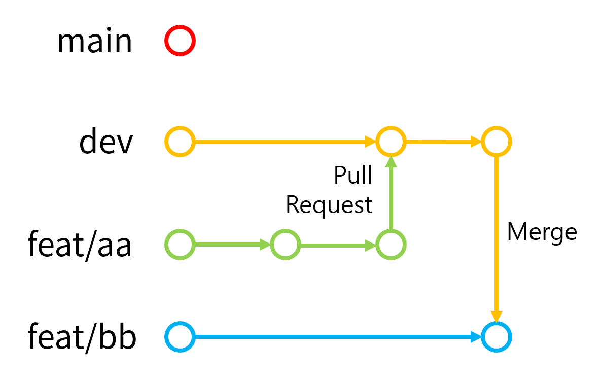

1. 위의 사진과 같이 특정 브랜치에 저장한 commit을 다른 브랜치에 반영하고 싶다면 브랜치를 병합(Merge)해야 합니다.
2. resumate 리포지토리의 브랜치 구성은 위에서 설명하였습니다. [이동하기: #브랜치](/#브랜치)
3. 부모 브랜치 -> 자식 브랜치 병합은 자유롭게 할 수 있지만, 자식 브랜치 -> 부모 브랜치 병합은 Pull Request를 등록한 후 부모 브랜치 관리자의 검토 및 승인을 통해 진행할 수 있습니다.
4. 다음의 상황 하에 Merge를 진행해 보겠습니다.
3. 부모 브랜치 -> 자식 브랜치 병합은 자유롭게 할 수 있지만, 자식 브랜치 -> 부모 브랜치 병합은 Pull Request를 등록한 후 부모 브랜치 관리자의 검토 및 승인을 통해 진행할 수 있습니다.
4. 다음의 상황 하에 Merge를 진행해 보겠습니다.

```
부모 브랜치: dev
자식 브랜치: feat/resume-2
```

5. 현재 브랜치는 `feat/resume-2` 브랜치가 선택되어 있습니다. Source Control 메뉴에서 다음과 같이 선택합니다.

⚠ **안내**

기본 모드로 Merge (3-way merge)하면 수십 개의 커밋이 브랜치로 그대로 병합되어 커밋 히스토리 관리가 까다로워집니다. 다음과 같이 `squash` 옵션을 추가하여 여러 커밋을 하나로 합쳐 주시기 바랍니다.

```
git merge origin/dev --squash
```

5. 현재 브랜치는 `feat/resume-2` 브랜치가 선택되어 있습니다. Source Control 메뉴에서 다음과 같이 선택합니다.

⚠ **안내**

기본 모드로 Merge (3-way merge)하면 수십 개의 커밋이 브랜치로 그대로 병합되어 커밋 히스토리 관리가 까다로워집니다. 다음과 같이 `squash` 옵션을 추가하여 여러 커밋을 하나로 합쳐 주시기 바랍니다.

```
git merge origin/dev --squash
```

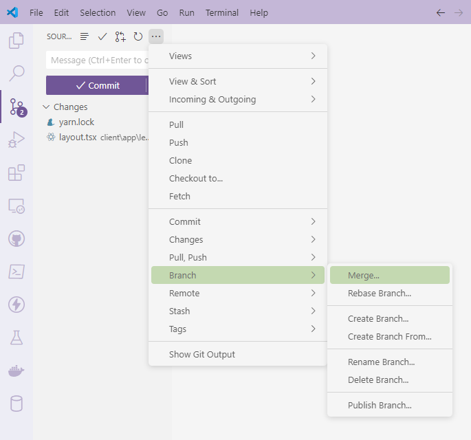

6. `dev` 브랜치를 선택합니다. 이는 `dev` 브랜치의 변경 내용을 `feat/resume-2` 브랜치로 병합하겠다는 의미입니다.
6. `dev` 브랜치를 선택합니다. 이는 `dev` 브랜치의 변경 내용을 `feat/resume-2` 브랜치로 병합하겠다는 의미입니다.

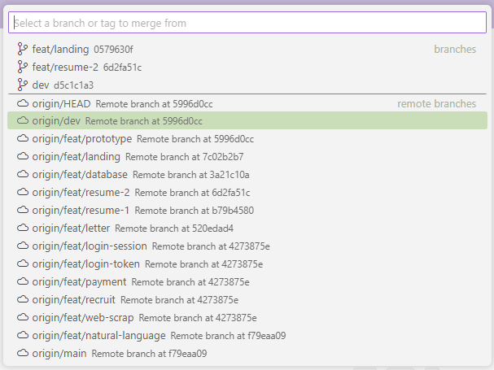

7. `dev` 브랜치의 커밋에서 수정된 파일 중에서 `feat/resume-2` 브랜치의 커밋에도 수정된 것이 있다면 충돌이 발생합니다. 다음과 같이 Merge Changes 아래에 수동 처리가 필요한 파일이 표시됩니다.
   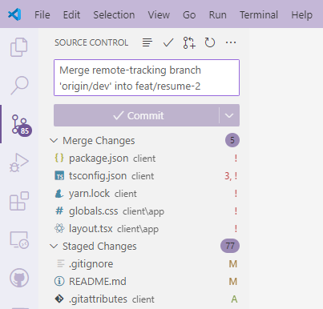

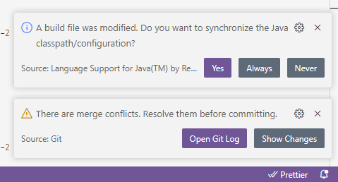

8. Merge Changes 아래 첫 번째 파일인 `package.json`을 클릭합니다. 이후 `Resolve in Merge Editor`를 클릭합니다.
8. Merge Changes 아래 첫 번째 파일인 `package.json`을 클릭합니다. 이후 `Resolve in Merge Editor`를 클릭합니다.

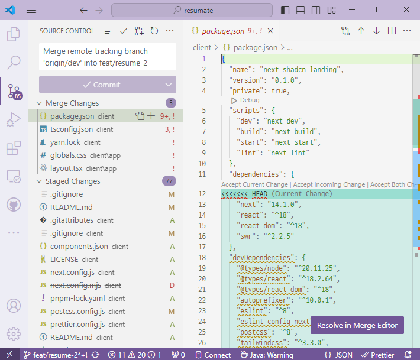

9. 상단 좌/우측에 표시되는 2가지를 비교하여 둘 중 선택할 변경 내용을 `Ctrl + A` -> `Ctrl + C` -> `Ctrl + V` 합니다.
9. 상단 좌/우측에 표시되는 2가지를 비교하여 둘 중 선택할 변경 내용을 `Ctrl + A` -> `Ctrl + C` -> `Ctrl + V` 합니다.

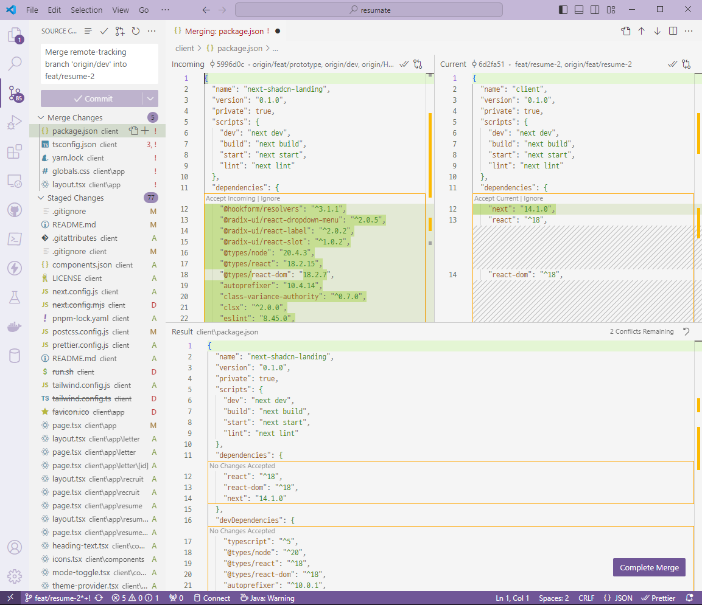

10. 완료, 종료합니다.
10. 완료, 종료합니다.

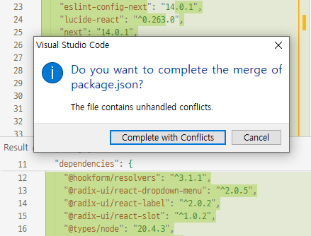

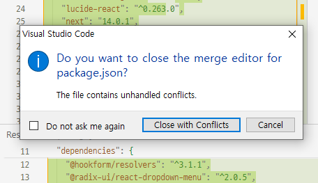

11. 이후 남아 있는 파일에 대해서도 같은 작업을 반복합니다. 다음과 같이 자식 브랜치에서 본인이 직접 작성한 코드가 있을 수도 있습니다. 저도 그래서 코드의 전체 부분을 주의 깊게 읽고 선택합니다.
11. 이후 남아 있는 파일에 대해서도 같은 작업을 반복합니다. 다음과 같이 자식 브랜치에서 본인이 직접 작성한 코드가 있을 수도 있습니다. 저도 그래서 코드의 전체 부분을 주의 깊게 읽고 선택합니다.


12. 충돌을 모두 해결하면 다음과 같이 Commit 버튼이 다시 활성화됩니다. 그대로 Commit & Push 진행합니다.
12. 충돌을 모두 해결하면 다음과 같이 Commit 버튼이 다시 활성화됩니다. 그대로 Commit & Push 진행합니다.

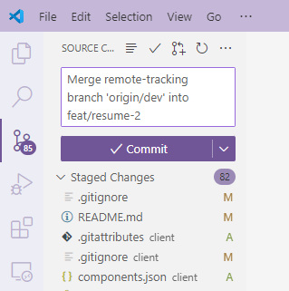

13. GitHub 레포지토리 페이지 접속 시 다음과 같이 방금 push되었다고 표시되면 성공입니다.
13. GitHub 레포지토리 페이지 접속 시 다음과 같이 방금 push되었다고 표시되면 성공입니다.

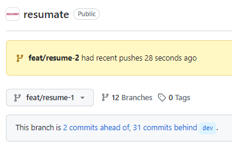

### Pull Request


1. 다음과 같이 부모 브랜치보다 자식 브랜치가 앞선 상태라면, Pull Request를 등록할 수 있습니다.

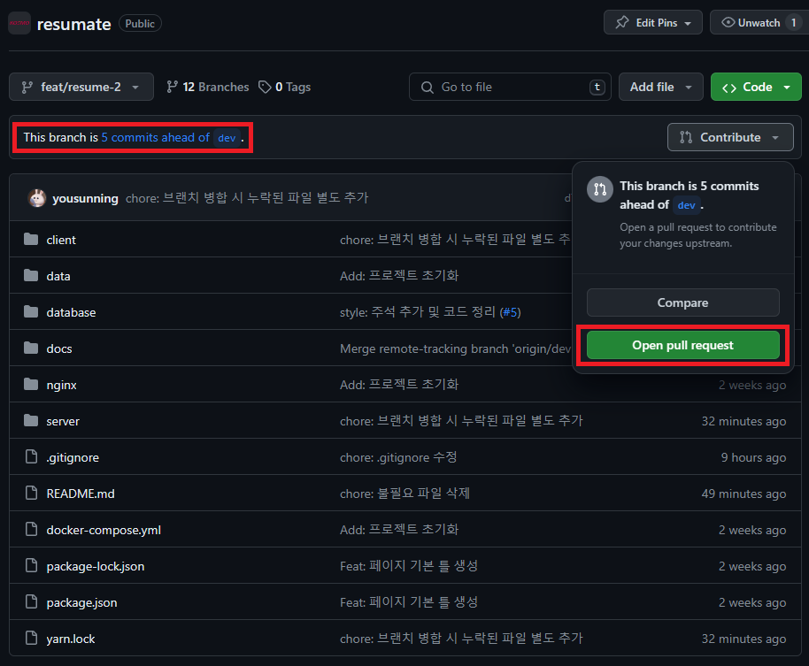

2. 제목과 내용은 Commit 메시지 작성과 비슷하게 입력하시면 됩니다. `Create pull request`를 눌러 PR을 등록하시면 제가 확인 후에 dev 또는 main 브랜치에 반영해 드립니다.

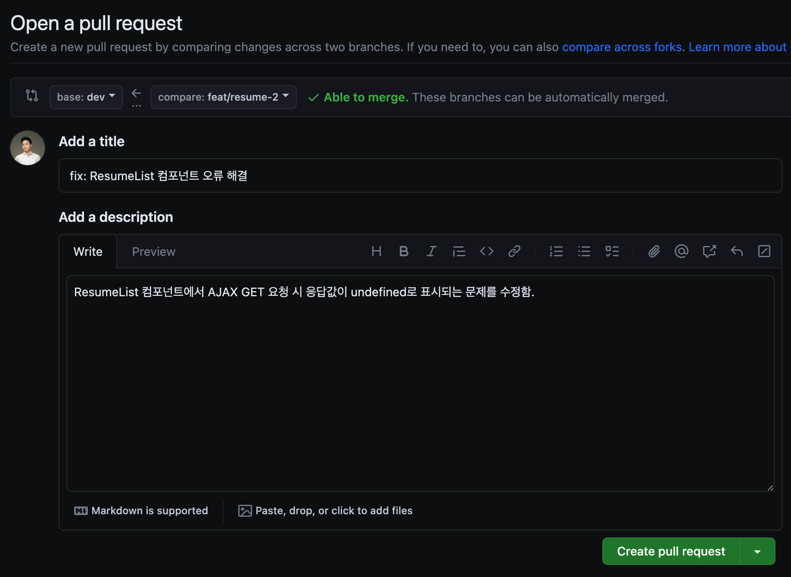

## 참고 자료


### https://github.com/jmadupalli/redy-blog


1. (Front) Next.js + (Back) SpringBoot
2. 로그인 및 글 작성/조회 기능이 구현된 블로그 프로젝트입니다.
3. Resumate의 기본 CRUD 기능을 구현하는 데 있어서 좋은 예시가 될 것이라 생각합니다.
4. 프로젝트의 구조와 파일 이름 등이 컨벤션을 준수합니다.
5. 위 프로젝트를 참고하여 파일 및 디렉토리 생성을 진행해 주시기 바랍니다.
