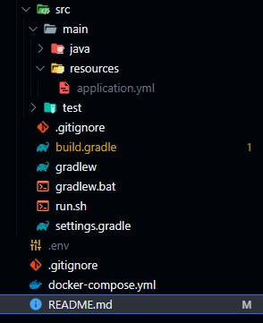

# 📝 Resumate
## 프로젝트 참여자 명단 및 역할, 작업 브랜치
### 김수영 [@suyons](https://github.com/suyons)
아이디어 기획, 일정 관리, 데이터베이스 구축, 웹 스크랩, 자연어 처리
* feat/database
* feat/web-scrap
* feat/natural-language
### 백소나 [@baeksona](https://github.com/baeksona)
웹 스크랩, 자연어 처리
* feat/web-scrap
* feat/natural-language
### 이동준 [@mogri89](https://github.com/mogri89)
이력서 정보 입력
* feat/resume-1
### 이수진 [@WGCAT](https://github.com/WGCAT)
자기소개서 페이지
* feat/letter
### 이수현 [@SH2G](https://github.com/SH2G)
로그인: Email을 이용한 회원가입 + 인증코드 발송
* feat/login-session
### 이준아 [@gliderjun](https://github.com/gliderjun)
로그인: 카카오 계정 OAuth
* feat/login-token
### 정유선 [@yousunning](https://github.com/yousunning)
이력서 정보 입력
* feat/resume-2
### 황태윤 [@taeyounh](https://github.com/taeyounh)
네이버페이 API 연동 결제 및 구글 애드센스 광고
* feat/payment

## 개발 환경 준비
### Git 설정
[Git - Downloads](https://git-scm.com/downloads)에서 `Git`을 설치한 이후 다음 명령을 입력합니다.

```bash
# username 대신 본인의 GitHub ID를 적어 주세요
git config --global user.name "username"
# my_id@domain.com 대신 본인의 GitHub 가입 시 지정한 이메일 주소를 적어 주세요
git config --global user.email "my_id@domain.com"
```
Repository를 clone합니다.
```
git clone https://github.com/suyons/resumate
```
기본값으로 main 브랜치가 선택되어 있으므로 전환합니다.
feat/database 대신 본인의 브랜치를 입력해 주세요.
```
git checkout feat/database
```

### docker-compose.yml
**실행 방법** [Docker Desktop 다운로드](https://www.docker.com/products/docker-desktop/)
```
docker compose up
```

1. 서버, 클라이언트, 데이터 영역의 앱을 분리하기 위해 
Docker 컨테이너로 필요 환경을 설치했으며
다음과 같이 총 4개 컨테이너를 하나의 묶음으로 compose 했습니다.
2. 이 구성 그대로 AWS 배포까지 진행할 예정입니다.
3. 개발 시 Docker 이용은 선택사항입니다.
4. 본인의 담당 기능을 구현하는 데 있어서 Python은 필요 없고 Node.js 하나만 필요하다면 컨테이너를 사용하지 않고 로컬에 설치하여 사용해도 상관 없습니다.

**각 컨테이너의 역할**
- Nginx: 리버스 프록시 [로컬 설치 링크](https://nginx.org/en/download.html)
- Amazon Corretto (OpenJDK 21): SpringBoot 프로젝트 실행 [로컬 설치 링크](https://docs.aws.amazon.com/corretto/latest/corretto-21-ug/downloads-list.html)
- Node: Next.js 프로젝트 실행 [로컬 설치 링크](https://nodejs.org/en/download/)
- Python: FastAPI 프로젝트 실행 [로컬 설치 링크](https://www.python.org/downloads/)

## 꼭 지켜 주세요
### 민감 정보
1. 민감 정보 예시
    * 데이터베이스 주소, 사용자명, 비밀번호
    * Open API Key
2. 민감 정보가 담긴 파일은 `.gitignore` 파일에 정의하여 GitHub 원격 서버로 Push되지 않도록 설정했습니다.
3. **`.gitignore` 파일을 절대 삭제하지 마시기 바랍니다.**
4. `.java`, `.tsx`, `.py` 등 코드 파일에 민감 정보를 포함하지 말아 주세요.
5. `.env`, `application.yml`과 같은 환경 변수 파일에 별도로 저장하시기 바랍니다.
6. **GitHub 서버에 민감 정보를 포함한 파일이 업로드되지 않도록 주의해 주시기 바랍니다.**
7. 제외 파일은 다음 사진과 같이 파일 이름이 회색으로 표시됩니다.


### 브랜치
```
main: 사용자에게 배포 가능한 상태
└── dev: 개별 기능 통합, 테스트 이후 main 병합
    ├── feat/database: 데이터베이스 구축
    ├── feat/login-session: 세션 방식 로그인 (이메일)
    ├── feat/login-token: 토큰 방식 로그인 (카카오 OAuth)
    ├── feat/resume-1: 이력서 입력 기능 - 1
    ├── feat/resume-2: 이력서 입력 기능 - 2
    ├── feat/letter: 자기소개서 출력 기능
    ├── feat/web-scrap: 웹 스크래핑 기능
    ├── feat/natural-language: 자연어 처리 기능
    └── feat/payment: 수익창출(네이버페이, 광고) 기능
```
1. 본인에게 배정된 브랜치만을 이용해 주시기 바랍니다. 타인의 브랜치에 commit & push 하면 충돌이 발생합니다.
2. **본인의 브랜치에서 commit & push를 1일 1회 이상 진행해 주시기 바랍니다.**
기능 구현 여부와 관계 없이 실시간 진행도를 파악하기 위한 목적입니다.

## Style Guide
1. **Formatter를 꼭 사용해 주시기 바랍니다.**
2. VS Code에서의 `Format Document` 단축키: `Alt + Shift + F`
3. 각 언어별로 제가 사용하고 있는 Formatter의 설치 링크를 추가했습니다.
### SQL
* [SQL 스타일 가이드 (Gitlab)](https://hing9u.tistory.com/83)
* Formatter: [SQLTools](https://marketplace.visualstudio.com/items?itemName=mtxr.sqltools)
### Java
* [Java 코딩 스타일 가이드](http://developer.gaeasoft.co.kr/development-guide/java-guide/java-coding-style-guide/)
* Formatter: [Language Support for Java(TM) by Red Hat](https://marketplace.visualstudio.com/items?itemName=redhat.java)
* Eclipse 단축키: `Ctrl + Shift + F`
### Javascript
* [코딩 스타일](https://ko.javascript.info/coding-style)
* Formatter: [Prettier](https://marketplace.visualstudio.com/items?itemName=esbenp.prettier-vscode)
### Python
* [구글 Python 스타일 가이드](https://yosseulsin-job.github.io/Google-Python-Style-Guide-kor/#s1.1)
* Formatter: [Black Formatter](https://marketplace.visualstudio.com/items?itemName=ms-python.black-formatter)
### Git Commit
* [[Git] Commit Message Convension (협업을 위한 git 커밋컨벤션)](https://velog.io/@msung99/Git-Commit-Message-Convension)
### 파일 및 폴더 이름
* 영문 소문자와 숫자로만 구성한다.
* 가능하면 짧게 구성한다(축약어 사용).
* 특수문자와 공백sᴘᴀᴄᴇ은 사용하지 않는다.
* 단어와 단어의 구분은 `-`(ʜʏᴘʜᴇɴ)으로 구성한다.

```
(Bad) /분석 프로젝트/01.TEST/(1월) 결과
(Good) /analysis-project/01-test/01-result
```

## Front-end
### MUI
1. Google의 Material Design을 구현한 오픈소스 React 컴포넌트 라이브러리입니다.
2. MUI를 이용하여 UI 요소를 간편하게 추가할 수 있습니다.
3. 주요 링크
    * [MUI 시작하기](https://mui.com/material-ui/getting-started/)
    * [컴포넌트 목록](https://mui.com/components/)
    * [템플릿](https://mui.com/material-ui/getting-started/templates/)
### [Figma](https://www.figma.com/)
1. 일관성 있는 UI 구현을 위해 Figma를 이용하여 선 디자인, 후 코딩 방식으로 진행해 주시기 바랍니다.
2. 다음의 Figma 작업 파일에서 컴포넌트를 복사/붙여넣기 하셔서 UI 요소를 간단하게 추가할 수 있습니다.
    * [Material UI for Figma (and MUI X)](https://www.figma.com/community/file/912837788133317724)
3. Discord에 공유한 Figma 파일 링크를 확인해 주세요.